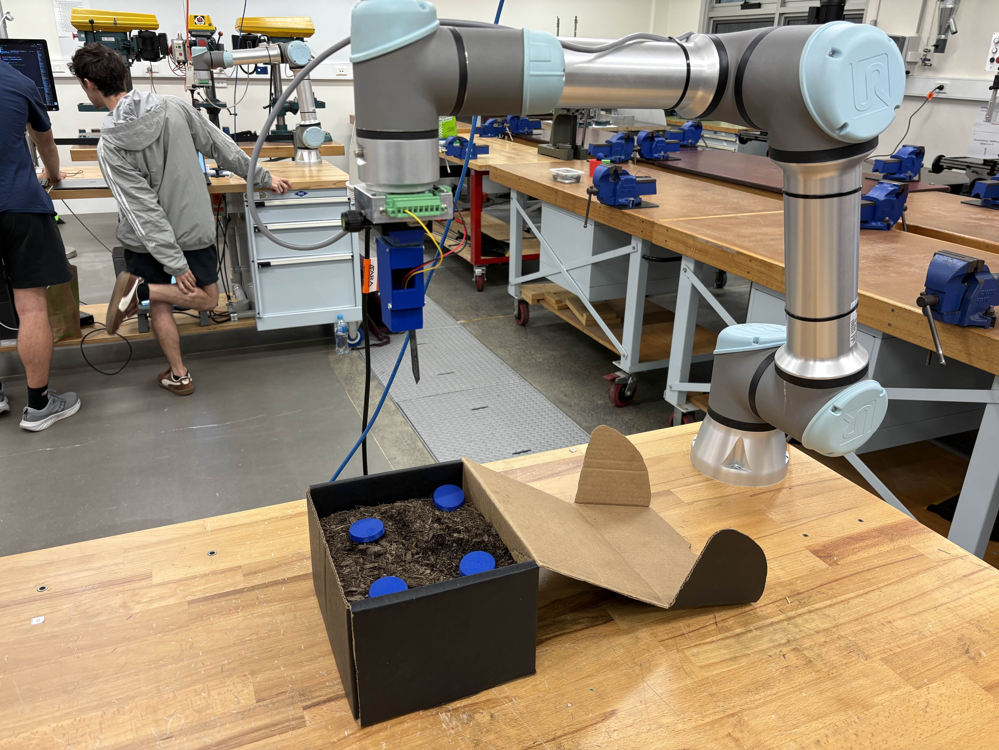
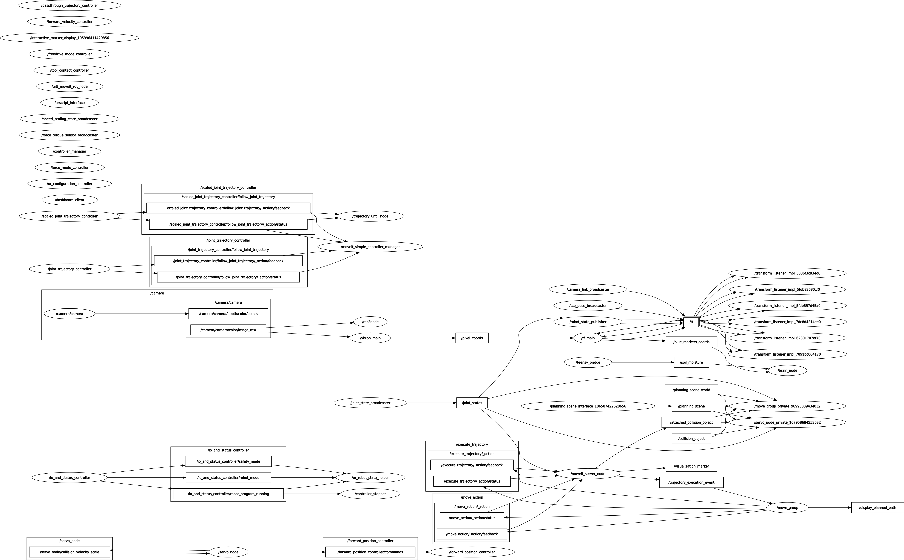
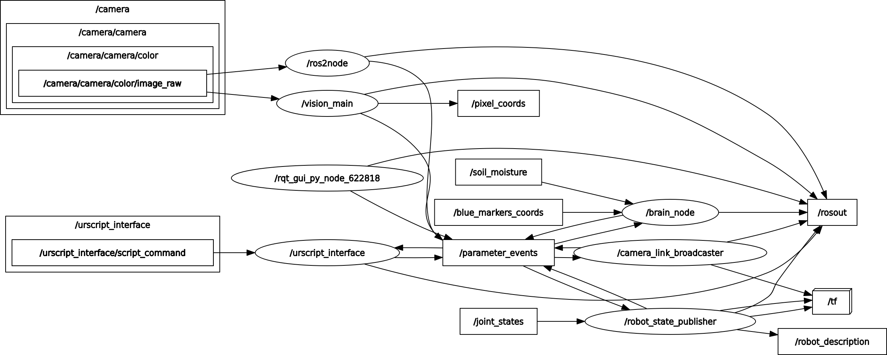
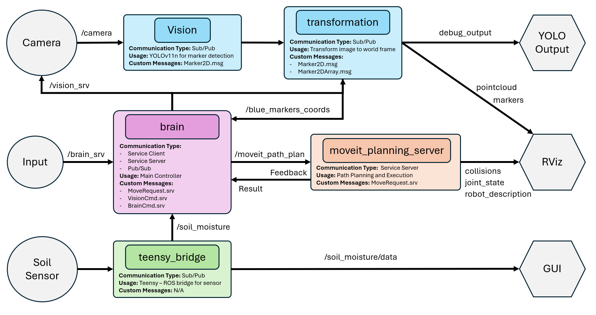
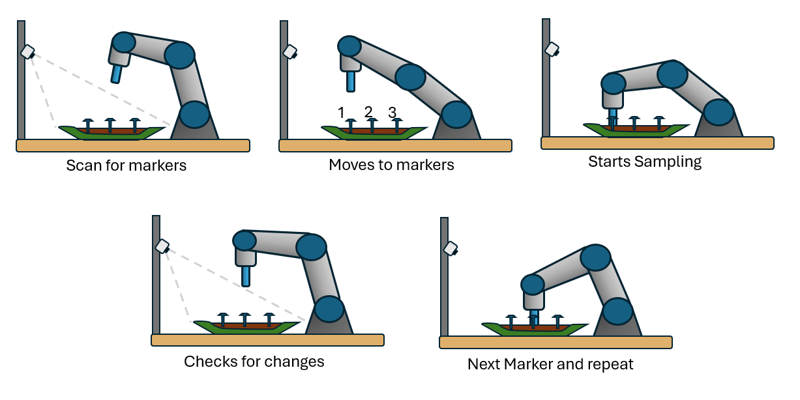
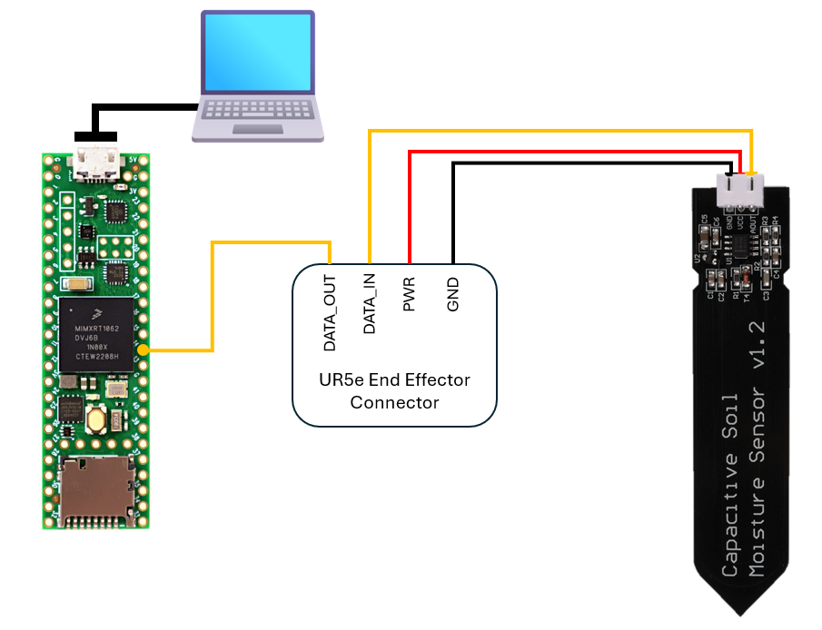
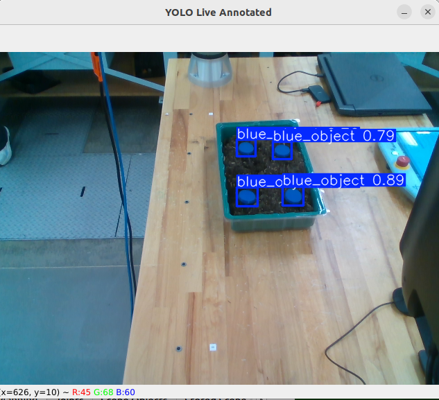
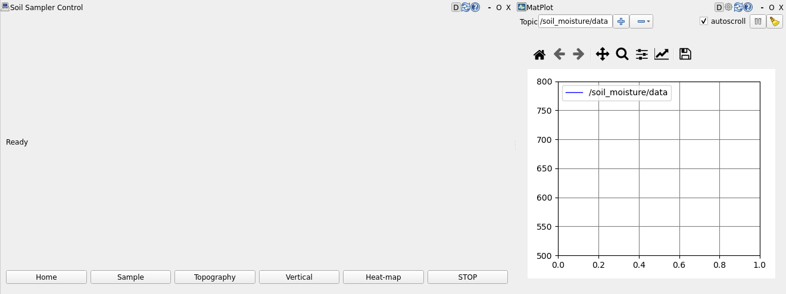

<!-- omit from toc -->
# SOIL BOT

- [Project Overview](#project-overview)
  - [Video Demonstration](#video-demonstration)
- [System Architecture](#system-architecture)
  - [ROS Packages and Node Descriptions](#ros-packages-and-node-descriptions)
  - [Closed-Loop System Behaviour](#closed-loop-system-behaviour)
- [Technical Components](#technical-components)
  - [Computer Vision](#computer-vision)
    -[Vision Pipeline](#vision-pipeline)
  - [Custom End-Effector](#custom-end-effector)
  - [System Visualisation](#system-visualisation)
  - [Closed-Loop Operation and Feedback](#closed-loop-operation-and-feedback)
- [Installation and Setup](#installation-and-setup)
  - [Prerequisites and Dependencies](#prerequisites-and-dependencies)
  - [Workspace Setup](#workspace-setup)
  - [Hardware Setup and Calibration](#hardware-setup-and-calibration)
- [Running the System](#running-the-system)
  - [Launching the Complete System](#launching-the-complete-system)
  - [Example Commands and Expected Output](#example-commands-and-expected-output)
  - [Testing Routines](#testing-routines)
- [Results and Demonstration](#results-and-demonstration)
  - [Performance Against Design Goals](#performance-against-design-goals)
  - [Quantitative Results (Accuracy, Repeatability)](#quantitative-results-accuracy-repeatability)
  - [Robustness, Adaptability, and Innovation](#robustness-adaptability-and-innovation)
- [Discussion and Future Work](#discussion-and-future-work)
  - [Engineering Challenges and Solutions](#engineering-challenges-and-solutions)
  - [Opportunities for Improvement](#opportunities-for-improvement)
- [Contributors and Roles](#contributors-and-roles)
- [Repository Structure](#repository-structure)
- [References and Acknowledgements](#references-and-acknowledgements)

[Minh]: https://www.linkedin.com/in/minh-thang-pham-493832265/
[Samuel]: https://www.linkedin.com/in/samuel-gray-mechatronic/?utm_source=share&utm_campaign=share_via&utm_content=profile&utm_medium=ios_app
[Brent]: https://www.linkedin.com/in/brent-poon-016bb6208/
[David]: https://www.linkedin.com/in/davidnie0418/

[UR10e]: https://github.com/DaviddNie/UR10e_vision_based_fruit_harvesting
[Screw]: https://github.com/DaviddNie/ScrewDrivingBot1 

[ROS Packages and Node Descriptions]: #ros-packages-and-node-descriptions

## Project Overview
Manual soil moisture testing is currently a labor intensive, slow, and inconsistent process. Farmers often rely on sparse data collected by hand or fixed sensors that cannot cover large areas or adapt to changing crop needs. This lack of data leads to inefficient irrigation, wasted water resources, and suboptimal crop yields. Our system solves this by deploying an autonomous robotic surveyor capable of identifying specific sampling locations and performing physical soil analysis without human intervention. By automating the data collection process, the system provides farmers with consistent environmental metrics (moisture and temperature) needed to make precision agriculture decisions.

### Robot Functionality
This system uses camera detection, collaborating the UR5e, and a custom end effector, designed to detect moisture and temperature, to enable the robot to move and obtain the moisture from the soil and to be consistently repeated in multiple areas. The system employs YOLO for precise marker identification. 

### Core Routines
The system executes four distinct autonomous routines:

* **Precision Soil Sampling:** Automatically navigates to detected markers to insert the sensor and capture moisture readings at specific points of interest.
* **Topography Mapping:** Surveys the physical height of the terrain across multiple points to generate a contour map of the surface.
* **Vertical Profiling:** Performs deep-dive analysis by inserting the sensor in incremental steps to measure moisture gradients at varying depths within the root zone.
* **Heat Map Generation:** Scans a defined grid sector to create a comprehensive moisture and temperature map of the entire workspace.

**Project Duration**: 6 weeks

**Authors**:
* Minh Thang Pham: [Minh's LinkedIn Profile][Minh]
* Samuel Gray: [Samuel's LinkedIn profile][Samuel]
* Brent Poon: [Brent's LinkedIn profile][Brent]

**Supervisor**:
* David Nie: [David's LinkedIn profile][David]

### Video Demonstration
* Click the Image for Demo Footage
[](https://youtube.com/shorts/Lg8x_b_xSfI?feature=share)


## System Architecture
### ROS Packages and Node Descriptions
- **brain**
  - Responsible for communication between nodes. 
  - Contains soil sampling logics and routine.
- **routines**
  - Contains routine logic to communicate with Brain
- **endeffector_description**
  - Responsible for custom URDF package for UR5e and end effector.
  - Two URDF exists, being a detailed EE visualisation and simplified EE for operation.
  - Interfaces with UR5e control drivers.
- **interfaces (custom messages and services)**
  - **srv**
    - BrainCmd
    - MoveRequest
    - VisionCmd
  - **msg**
    - Marker2D
    - Marker2DArray
    - MarkerData 
- **interfaces**
  - Custom messages and service calls.
- **moveit_planning_server**
    - Cartesian motion control, converts desired cartesian pose into corresponding joint trajectories.
    - Monitors safety planes, collisions and joint speed limits.
- **take_image**
  - Enables the camera
- **teensy_bridge**
  - Publishes soil sensor readings at 9.6 kHz
- **transformation**
  - tf_main: Main transformation calculations.
  - tf_publisher: Publishes world-frame transformation coordinates.
  - tf_subscriber: Subscribes from vision_main.
  - tf_utils: Additional transformation calculations and adjustments.
- **ur_moveit_config**
  - Determines path planners and movement configurations
- **vision**
  - Detect desired markers and provides position via YOLOv11n.
  - Publishes coordinates in image frame.

### Interfaces
- **srv**
  - **BrainCmd**
    ```
    string command
    ---
    bool response
    ```
    **Explaination:**
    A simple string command to tell which routine to run. Returns if response is successful or not.

  - **MoveRequest**
    ```
    string command
    float64[] positions
    ----
    bool success 
    ```
    **Service Call:**  
    ```
    positions: target positions [x, y, z, r, p, y] or [joint1, joint2, joint3, joint4, joint5, joint6]
    ---
    success: boolean
    ```

    **Explaination:**
    The command line to move the the robot with a given command and target position

  - **VisionCmd**
    ```
    string command
    ---
    interfaces/MarkerData marker_data
    ```

    **Explaination:** A service call that triggers the object/marker detection event.

- **msg**
  - **MarkerData**
    ```
    #-------------------------------------------------------------------#
    #   id:   Numeric ID of marker.                                     #
    #   pose: Flattened [x, y] vector (6 elements) representing         #
    #         marker’s 3D position orientation in camera or world frame.#
    #-------------------------------------------------------------------#

    float32 id
    float32[] pose
    ```

    **Explaination:** Used to sort and determine unique and duplicate markers.

  - **Marker2D**
    ```
    #-------------------------------------------------------------------#
    #   id: Numeric ID or sequence index of the marker.                 #
    #   x: x coordinate of world frame position of that id value.       #
    #   y: y coordinate of world frame position of that id value.       #
    #-------------------------------------------------------------------#
    
    float32 id
    float32 x
    float32 y
    ```

    **Explaination:** This is similar to MarkerData and is used to store world x and y coordinates with corresponding marker's ID.

  - **Marker2DArray**
    ```
    #-------------------------------------------#
    #   markers: Array of Marker2D messages     #
    #-------------------------------------------#
        
    Marker2D[] markers
    ```

    **Explaination:** Puts individual Marker2D markers into a singular array to be published. An example output could be: **[[id: 0, x: 0.1, y: 0.2]**, **[id: 1, x: 0.5, y: 0.5]**, **[id: 2, x: 3.2, y: 1]]**

#### RQT Graph
<center></center>

A simplified figure without camera can be shown below: 

<center></center>

#### Package Level Interaction
<center></center>


### Closed-Loop System Behaviour
The system operates using a fully closed-loop control architecture, where the soil sensor measurements continuously influence and correct robot behaviour during operation. This ensures that the robot responds dynamically to environmental variation such as marker position changes, depth shifts, or sensor noise rather than relying on static commands calls.

#### How the Feedback Loop Works
The following is a step-by-step run through of the closed-loop process:

**1. Detect Marker**
- Vision publishes pixel centroids then transformation node outputs world coordinates.

**2. Update Robot Target**
- Brain node receives coordinates and sends a movement request with the latest world pose (x, y, z, r, p, y).

**3. Move and Re-evaluate**
- The robot begins to move toward the target.
- If a new marker position is detected during movement, the updated coordinate is sent to the brain.
- Brain can interrupt the current command and re-issue a corrected MoveRequest to remove accumulating error.

**4. Perform Soil Measurement**
- Once the robot reaches the sampling point, the end-effector lowers into the soil.
- The Teensy continuously sends moisture readings.
- The robot remains in position until readings stabilise, then lifts and returns to safe height.

**5. Advance to Next Target**
- Brain increments the marker ID and repeats.

#### How the System Adapts in Real Time
**Correction for detection drift:**
If lighting changes or the camera shifts slightly, the vision module will still locate the marker and update its position. The robot always follows the current transformed coordinates instead of precomputed ones.

**Avoiding accumulated pose error:**
Rather than assuming the robot reached its target perfectly, every new motion command is generated from fresh vision data.

**Safe end-effector operation:**
The robot lowers only until the depth sensor confirms a stable soil contact point, preventing over-penetration.

**Dynamic task execution:**
If markers are lost or newly detected, the brain node adapts by updating the processing list in real time.


### Operation Plan Overview
The following diagram is a high-level overview of the operational loop of the basic soil sampling routine.
<center></center>

### System Flowchart

<center></center>

## Technical Components

### Computer Vision:
The computer vision system is built around a YOLOv11n object detection model trained on a dataset containing blue markers. Its primary function is to detect the markers within the camera’s field of view and provide their pixel-level locations for downstream processing.

#### Vision Pipeline

##### Image Acquisition
- A continuous image stream is received from the camera. To reduce computational load, frames are sampled at a lower frequency of 5 Hz, while still maintaining sufficient resolution for reliable detection.

##### Object Detection (YOLOv11n Model)
- Each sampled frame is passed through the YOLOv11n network.
- The model outputs bounding boxes around detected blue markers.
- These detections are filtered and annotated to visually confirm correct identification.

##### Centroid Extraction
- For each bounding box, the system computes the centroid (x,y) in pixel coordinates.
- This represents the marker’s location in the image plane.
- These centroid values are published on the /pixel_coords ROS topic.

##### Coordinate Interface to Transformation Module
* Coordinate Interface to Transformation Module
- The pixel-coordinate detections form the input to the coordinate-transformation stage, which converts pixel positions into real-world spatial coordinates using camera calibration and transformation pipelines.

#### Contribution to the Overall Task

- This vision pipeline provides the initial positional information required for the system to understand where each blue marker is located relative to the camera.
- Since the markers are the key references for localisation or manipulation, accurately detecting their pixel coordinates is essential.
- By supplying consistent and reliable pixel-space measurements, the vision module enables the transformation module to compute physically meaningful positions in the environment — ultimately supporting the robot/system in tasks such as alignment, motion planning, or measurement.

### Custom End-Effector

<center>



</center>
  
The end effector uses 4xM3 bolts from the bottom of the end effector, with hex screws to secure above the lid. Inside the end effector there are two tabs (see drawing) that match the tabs on the moisture sensor. Place the moisture sensor as to have these line up. 

### System Visualisation
The system is visualised via 3 main components, being RViz, YOLO and a RQT custom user interface.  

#### RViz
RViz is responsible for the main visualisation of the program. There are 4 main elements that will be displayed within the RViz window being:
- UR5e Arm attached with simplified end effector
- Bounding/Safety Planes
- Visualisation Markers
- Point-Cloud Visualisation

<center></center>

#### YOLOv11n
A live-feed pop-up of YOLOv11n's output will be displayed. This output as stated above, will be the camera's view with bounding boxes around desired detected objects. An example can be seen below
<center></center>

#### RQT GUI
The GUI is a simple user interface, consisting of 6 buttons being: 
- **Home:** Sends the UR5e arm to the default set home position.
- **Sample:** Starts default soil sampling process, where target markers locations are probed.
- **Topography:** Maps surface unevenness by recording the exact Z-height of soil contact across a grid.
- **Vertical:** Measures moisture levels at multiple depths at a single location to analyze vertical distribution.
- **Heat-map:** Samples the four corners of the workspace at a fixed depth to provide a broad moisture overview.
- **STOP:** Emergency STOP broadcast.

Additionally, a RQT Plot can be opened to display the current readings from the soil sensor.
<center></center>


#### Contribution to the Overall Task
- Provides real-time feedback for each individual nodes.
- These three streams work together to ensure that the visualisation and operation is seamless between both virtual and physical, acting as functional digital twin. 

### Closed-Loop Operation and Feedback
Vision feedback continually updates the robot with the current marker positions, ensuring accurate and reliable target localisation. Motion feedback from MoveIt ensures that each planned movement remains safe, feasible, and within joint limits. Finally, the soil-probe sensor provides real-time moisture readings, allowing the robot to confirm successful soil contact before recording data.

#### Closed Loop Pipeline
The system uses three primary real-time feedback loops being:

**Computer Vision Feedback (YOLO + Camera)**
- The vision node continuously detects blue markers and publishes updated centroid pixel coordinates.
- These coordinates are converted into world-frame positions through the transformation module.
- This ensures that every robot movement is based on the current marker position, not a previously captured value.

**Robot Motion Feedback (UR5e + MoveIt)**
- MoveIt provides real-time feedback about joint states and end-effector pose.
- Planned trajectories are continuously checked for validity and re-evaluated if obstacles or inconsistencies are detected.

**End-Effector Sensor Feedback (Teensy Moisture Probe)**
- During soil measurement, the moisture probe sends continuous analogue readings.
- The robot waits until a stable reading is detected before lifting and moving to the next point.

## Installation and Setup
### Operating System
The program needs to ran on a native Ubuntu 22.04.5 LTS boot.

### ROS2
This system needs to be ran on ROS2 Humble distro. For instructions for installing ROS2 Humble, refer to ROS2's [official installation documation](https://docs.ros.org/en/humble/Installation.html).  
Once ROS2 is installed, install the following ROS2 libraries

```
sudo apt-get install ros-humble-ur
sudo apt install ros-humble-moveit
```

### Vision
Ensure that ROS2 is installed with the following packages

```
pip install ultralytics
pip install cv2
pip install numpy
```

### Transformations
Ensure that the following package is installed

```
pip install pyrealsense
```

### End Effector
Ensure that an Arduino IDE version >= 2.0 is installed, if not, follow Arduino's [official installation guide](https://docs.arduino.cc/software/ide-v2/tutorials/getting-started/ide-v2-downloading-and-installing/)  
Download the Teensy 4.1 board manager for Arduino following the [installation guide for Linux](https://www.pjrc.com/teensy/td_download.html)

### System and Workspace Setup
Move into the root directory of this repository, build and source the system before starting any testing or operations. NOTE: source the ros distro by choosing the correct setup file suffix that corresponds to the operating system and shell (for UNIX-based systems, this will be .bash)
```
colcon build
source install/setup.bash
```

### Hardware Setup and Calibration

#### Camera
The camera used for this project is the 'Intel Realsense D435 Depth Camera
More information about the camera can be found [here](https://www.manualshelf.com/manual/intel/82635awgdvkprq/product-data-sheet-brochure-english.html).

* Install Realsense:
```
sudo apt install ros-humble-realsense2-camera
```

* USB Connection:
- Connect Camera to USB 3.0 Port
- Verify Detection: rs-enumerate-devices

* Camera Calibration:
- Assume hand-eye calibration is present


#### End Effector
The moisture sensor needs to be calibrated by measuring the ambient moisture in the air compared to within the soil. Make a note of this value and change the variable to match this threshold, as shown below. 
```
declare_parameter<double>("soil_threshold", 1000.0);
```

## Running the System
To run the entire system, only one launch file is required which is located within src/brain/launch directory. There exists two options to launching the program, one for connection with a physical robot and the other is a virtual simulation.  

To toggle between real and simulation, check with the launch file ur_with_endeffector within src/endeffector_description.
```
use_fake = True     # Using simulated robot
use_fake = False    # Using real robot
```

To launch the system, run 
```
ros2 launch brain system_launch.py
```

In a new terminal within the root directory, open run **rqt** and click **Plugins -> Robot Tools -> UR5e Moveit Control**. Next **Plugins -> Visualisation -> Plot** and add **/soil_moisture/data** to visualise soil sensor readings.  
This is the main GUI for the program and consists of sampling routine options, HOME and STOP buttons. 

Note that for sake of debugging and testing, each module can be ran seperately, instructions will be covered below.


Clear instructions for launching and running the complete system
Example commands (e.g. ros2 launch project_name bringup.launch.py).
- Expected behaviour and example outputs.
- Optional troubleshooting notes.
- The system should be launched by a single command (e.g. via a launch file, shell script
or Docker image), without manual sequencing.

### Testing Yolo Model
To test the model and the basic running of computer vision run,
'python vision_basic.py'

Note:
- Model path inside vision_basic.py need to be editted in respect to best.pt location
- Image path need to be editted in respect to the image analysed (Located in datasets)
- Confidence may need to be lowered depending if it the code successfully identifies the objects

### Testing Moveit Movement Server
To run the movement server seperately, there are two launch files that needs to be ran being **ur_with_endeffector.launch.py** and **moveit_planning.launch.py**. NOTE: this needs to be 2 seperate terminals.
```
ros2 launch endeffector_description ur_with_endeffector.launch.py
ros2 launch moveit_planning_server moveit_planning.launch.py
```
Same as stated above, toggle **use_fake** to connect with the virtual or physical UR5e arm. 

As with all nodes and packages in the system, this server is able to receive custom CLI service calls via the MoveRequest format which an example can be seen as follows
```
# Cartesian Path Call
ros2 service call /moveit_path_plan interfaces/srv/MoveRequest "{command: 'cartesian', positions: [0.50, 0.35, 0.30, -3.1415, 0.0, 1.57]}"

# Joint Call
ros2 service call /moveit_path_plan interfaces/srv/MoveRequest "{command: 'joint', positions: [-1.57, 1.57, -1.83, -1.57, 0.0, 0.0]}"

# Stop
ros2 service call /moveit_stop std_srvs/srv/Trigger "{}"
```
As seen above, the two main movement services are **cartesian** and **joint**. There does exists two other options being **line** and **pose** which are OMPL-based planners as compared to **cartesian** using a cartesian planner. Whilst OMPL-based approach does work, it possess inferior path-planning speed and accuracy as comapred to a cartesian-based apporach and as such was not utilised.

The server is a multithreaded operation, as such, it is possible to call multiple services at once, which is precisely why STOP works.


### Testing End Effector
Open the installed Arduino IDE and upload /MTRN4231/end_effector/arduino/Soil_moisture_reading/Soil_moisture_reading.ino after wiring according to wiring diagram. To start reading from the sensor, run
```
ros2 launch teensy_bridge teensy_bridge_launch.py
```
Soil sensor data should start being visualised on the RQT GUI.

If no access to the end effector is availble or using a virtual simulation, dummy inputs from the sensor can be emulated directly from the brain.
```
ros2 run brain dummy_inputs.py
```

### Testing System with End Effector
To launch the system, run 
```
ros2 launch brain system_launch.py
```
This will start all the appropriate files. To test without end effector, change in system_launch.py **ur_with_endeffector.launch.py** to **display.launch.py**. Alternatively, run
```
ros2 launch brain system_launch.py  use_fake_hardware:=false
```
### Testing Routines
You can trigger the robot's autonomous routines either via the **rqt GUI** (if configured) or directly via the terminal using `ros2 service call`.

### 1. Triggering Routines
To manually run a routine, open a new terminal and run the following command:

```
ros2 service call /brain_srv interfaces/srv/BrainCmd "{command: 'COMMAND_NAME'}"
Available Routine Commands:

soil_sampling - Precision Soil Sampling (Visits detected markers)

topography - Topography Mapping (Surveys terrain height)

vertical - Vertical Profiling (Deep-dive moisture analysis)

heat_map - Heat Map Generation (Scans the entire sector)

```

As an example: 

```
ros2 service call /brain_srv interfaces/srv/BrainCmd "{command: 'soil_sampling'}"
```
### 2. Vision vs. Test Mode
The system can operate in two modes: Live Vision (using the camera) or Test Mode (using hardcoded coordinates for debugging).

To disable Live Vision:

Open the desired routine file (e.g., src/brain/src/routines/soil_routine.cpp).

Change the vision flag at the top of the file:

```
#define USE_VISION 0
```
Rebuild the package to apply changes:

```
colcon build --packages-select brain
```
### Common Errors and Troubleshooting
- If the movement services aren't being applied to the real UR5e, double check that the connection program on the UR5e pendant is actively running and is able to communicate. Everytime the system is launched or relaunch, it is required to re-run the communication program on the teaching pendant.
- Ensure not to run Arduino's Serial Terminal or there are more than one program accessing the teensy port. If there are more than one program utilising the teensy port simultanuously (possibly from a previous group), this will prevent the ROS-Teensy bridge from being able to read incoming data from the sensor. While running the system, the port usage can be checked via the command below. If there is a second application use the kill command.
  ```
  lsof /dev/ttyAMC0

  # If there's a second program
  kill {insert PID}
  ```


## Results and Demonstration

### Performance Against Design Goals
* Reliability of system: 1 Failure per 500 Samples
- The integrated UR5e–camera–sensor workflow remained highly reliable throughout testing.
- System faults (including failed detections, improper placement, or communication delays) occurred significantly less than the allocated threshold.
- This indicates that the system is stable and capable of extended autonomous operation without frequent human intervention.

* Cycle time: Less than 1 minute per sample
- The average cycle time per sampling point consistently remained below the 5-minute target.
- The combination of efficient path planning on the UR5e, rapid detection from the vision system, and the optimized custom end effector contributed to meeting this requirement.
- This demonstrates that the system is suitable for large farms where high-throughput sampling is required.

* Sampling Accuracy: Within 2mm placement of sensor
- Experimental validation showed that the robot can position the moisture probe within the required ±2 mm accuracy.
- The use of camera-based detection, paired with the UR5e’s precise kinematics, ensured that the end effector consistently reached the intended soil location.

* Sensor Accuracy: Within 100 Analogue units ***
- Repeated measurements at controlled moisture levels confirmed that the custom-designed moisture sensor maintains accuracy within the target range.
- Signal conditioning and calibration helped reduce analogue drift, ensuring reliable moisture readings across repeated trials.

* Accuracy: Within 10 mm of sensor position for same sampling point
- The robot demonstrated excellent repeatability, routinely returning to the same sampling point with sub-millimetre variance.
- This is largely attributed to the UR5e’s high mechanical precision and consistent camera-derived coordinates.
- Such repeatability is essential for long-term agricultural monitoring where sampling locations may be revisited repeatedly.

### Quantitative Results (Accuracy, Repeatability)
The performance testing metrics that the system is scored to are explained as follows:
- **Detection Accuracy**
  - Rating out of 1
  - The confidence that there is an object present in the image
  - This also an average of all 4 markers present in the camera feed

- **Sampling Time / Execution Time**
  - In seconds
  - The time it takes for the sample and the execution of the robot to run once

- **Sampling Accuracy**
  - In percentage
  - The accuracy of the sample 

- **Sensor Accuracy**
  - In percentage
  - The accuracy of the sensor

|     Test     | Detection Accuracy | Sampling Time / Execution Time (seconds) | Sampling Accuracy (%) | Sensor Accuracy (%) |
|--------------|--------------------|------------------------------------------|-----------------------|---------------------|
|      1       |        0.79        |                    50                    |          90           |         97          |
|      2       |        0.82        |                    45                    |          85           |         96          |
|      3       |        0.84        |                    55                    |          86           |         98          |
|      4       |        0.74        |                    43                    |          88           |         98          |
|      5       |        0.87        |                    47                    |          91           |         95          |
| **Averages** |        0.812       |                    48                    |          88           |         96.8        |


### Robustness, Adaptability, and Innovation
- Robustness
  - The YOLO trained computer vision model works well in different orienation and lighting. It is able to detect blue markers at a fast refresh rate and exibits high confidence levels.
  - The end effector, given it's simplistic design and sturdy structure is extremely resistant to breaking or malfunctions.
  - The ability for the Moveit implementation to repeatedly move the UR5e to accurate coordinates and pose without unexpected behaviours has been achieved through cartestian path planning, meaning any innacuracies or failures have been completely mitigated.
  - A major robustness improvement was the implementation of 'Cartesian Path Planning' for all sensor interactions. Unlike standard joint space planning, which can produce unpredictable arcs, Cartesian planning forces the robot to move in strict linear lines. This acts as the primary safety layer, ensuring the arm stays within the safe workspace, while the defined safety planes serve as a redundant backup rather than the only constraint.
- Adaptability
  - A majority of the computer vision aspect relies on the realsense camera hardware, as it most of the functions calls from the specs.
  - Vision is quite adaptable and can be improved upon via the training data in Yolov11 files to aim for either different coloured markers or to different environments.
  - For moveit, the movement is adaptable within any and all environments, given that the safety planes and constraints have been setup correctly which is relatively simple process.
  - Works within all environments, as long as the sensor is properly calibrated. The closed loop system offers high levels of adaptability to environmental or physical changes. However, the camera must remain unobstructed.
- Innovation
  - Although there are some example similar to this project, there have been no example of pure automation of consistent soil detection.
  - Cartesian movement instead of OMPL-based planners to achieve fast, accurate and responsive movements as compared to OMPL long planning time and random path generation.
  - A critical technical challenge was enabling the robot to stop immediately upon detecting soil contact. In standard ROS 2 architectures, a long-running motion command can block the execution thread, preventing the system from processing new sensor data until the movement is complete. To solve this, we implemented a Multi-Threaded Architecture using ReentrantCallbackGroups. This allows the "Brain Node" to run the motion routine on one thread while simultaneously processing high-frequency sensor data on another. This design ensures that the instant the moisture threshold is breached, the system can interrupt the active move command and trigger an emergency stop, preventing damage to the sensor or the environment.

## Discussion and Future Work
Our approach to this project has a simple objective to only detect the soil, which makes it effective and simple to complete the tasks without difficulty. It is creative as although there is a lot of soil detection related technology, not many of them are automated or utilises robot, as most uses are manual or requires manpower to run them in the real world. This idea is not novel to an extent but it provides an different approach to utilising this technology. 

### Engineering Challenges and Solutions
There were several engineering challenges that were faced during the development of this project. Such challenges faced were:
- Robot Arm Path Planning
  - Initial Moveit integration into the ROS2 posed a significant challenge as the end result was often unreliable and unpredictable path planning and long planning times. As the end goal of the solution was to allow for rapid and accurate UR5e arm positioning, another method had to be utilised. As such, OMPL was ditched and cartesian path planning was utilised to provide a reliable solution.
- Robot Kinematic Constraints
  - On rare occasions, the joint velocity required from moveit's cartesian path planning would excedd the safety limit of the physical UR5e itself. This would always result in a failure and sudden stop during sampling routines and proved catastrophic for operations. This was solved through limiting the joint velocity and acceleration of the planner when conducting certain tasks to ensure that the joint velocity limit does not get exceeded.
- System Intergration
  - Multiple errors through node and topic name mismatches were encountered when trying to integration each package into a cohesive solution. This was remedied through the creation of a high-level interaction diagram with dedicated topic names and communication methods, to which the team is able to refer to and take references from.
- End Effector
  - One of the significant mechanical hurdles was securing the capacitive moisture sensor within the custom end effector. Initial designs allowed for slight movement of the probe during soil insertion, which caused inconsistent contact angles and potential damage to the sensor PCB. We went through multiple design iterations due to this issue. Further, half way through the design process after Gateway 2, the team switched the end effector design to be vertical rather than perpendicular to the angle of the wrist. This design choice initially hinderer our progress but we successfully ended with a secure end effector. 
  - The Capacitive Soil sensor v1.2 whilst cheap, is well known to be inaccurate and faulty, as such proper calibration and maintainance was taken to ensure that the readings were as accurate as possible.
  - While the capacitive sensor provides immediate feedback, the team encountered challenges with data consistency and noise. Factors such as varying soil density and slight changes in insertion depth affected the raw analog readings. To mitigate this, we implemented software-side filtering in the Brain Node, using a moving average or threshold-based logic to reject outliers and ensure that only stable, valid readings were recorded during the sampling process.

For problems that was outside of the scope of the team's expertise, the solution was to obtain assistance from other teams, the supervisor, and generative AI whenever possible.

### Opportunities for Improvement
Due to the simipicty of the project, there are many improvements that can be made.

The following below are some things that can be improved on for "Version 2.0":
- End effector with different tools on it, where it can switch each tool in and out of use, with the capacity to dig and plant seed. A suggested design would be adding an auger bit as well as a tube to output water.
- A greater dataset could have been made for YOLO11 to ensure it is consistent in detecting all the objects required.
- Instead of only using blue markers as it's main detection, it could also detect other items, such as plants or rocks in the soil. This would also enable crash avoidance and allow farmers to guide the robot through harsh terrains.
- A more detailed GUI could be implemented instead of simple buttons.
- The ability to real-time obstacle detection and avoidance via depth camera.

## Contributors and Roles
* Minh: 
  - Primary Areas of Responsibility:
    - Moveit
    - Integration
    - Testing/Quality Control

* Samuel:
  - Primary Areas of Responsibility:
    - Endeffector
    - Brain
    - Integration

* Brent: 
  - Primary Areas of Responsibility:
    - Computer Vision
    - Transformations of coordinates


## Repository Structure
```
MTRN4231/
├───img
├───yolo_dataset
│   ├───train
│   │   ├───images
│   │   └───labels
│   └───val
│       ├───images
│       └───labels
├───received_images
├───src
│   ├───vision
│   │   ├───launch
│   │   ├───vision
│   │   └───resource
│   ├───teensy_bridge
│   │   ├───launch
│   │   ├───teensy_bridge
│   │   │   └───__pycache__
│   │   ├───resource
│   │   └───test
│   ├───transformation
│   │   ├───launch
│   │   ├───resource
│   │   └───transformation
│   ├───endeffector_description
│   │   ├───launch
│   │   ├───meshes
│   │   ├───urdf
│   │   │   └───old
│   │   └───rviz
│   ├───interfaces
│   │   ├───msg
│   │   └───srv
│   ├───ur_moveit_config
│   │   ├───launch
│   │   ├───srdf
│   │   ├───config
│   │   ├───ur_moveit_config
│   │   └───rviz
│   ├───brain
│   │   ├───launch
│   │   ├───test_nodes
│   │   ├───include
│   │   │   └───brain
│   │   │       └───routines
│   │   └───src
│   │       └───routines
│   ├───take_image
│   │   ├───launch
│   │   ├───resource
│   │   └───take_image
│   ├───ur5_moveit_rqt
│   │   ├───resource
│   │   ├───ur5_moveit_rqt
│   │   └───test
│   └───moveit_planning_server
│       ├───launch
│       └───src
└───end_effector
    └───arduino
        ├───Soil_moisture_reading
        └───Soil_test_for_ur5e
```
Each folder does the following -
- End_effector:
  - Using Arduino to run the end effector with UR5e
- src:
  - The main folder which contains all the packages
  - These packages are explained in [ROS Packages][ROS Packages and Node Descriptions]
- yolo_dataset:
  - Only contains images that were used to train the Yolo model
- img:
  - Contains files used for README.md

## References and Acknowledgements
- MTRN4231 Labs Week 1-5
- David Nie's Github Repositories
  - [UR10e Vision Based Fruit Harvesting][UR10e]
  - [Screw Driving Bot][Screw]
